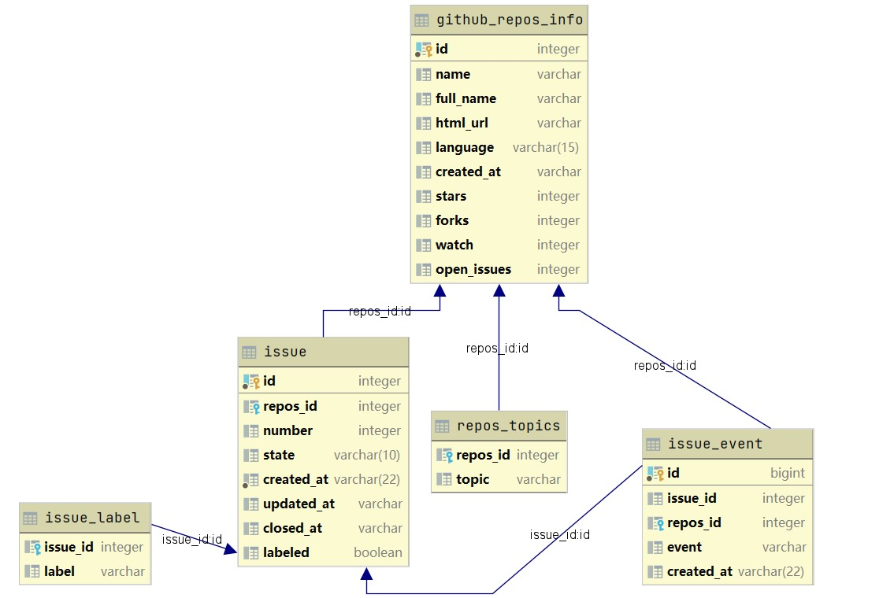
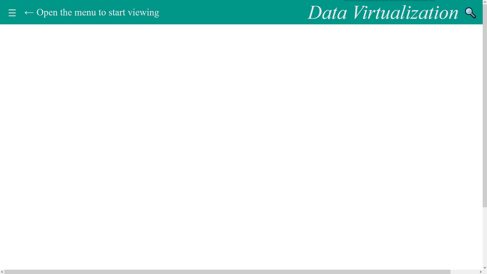
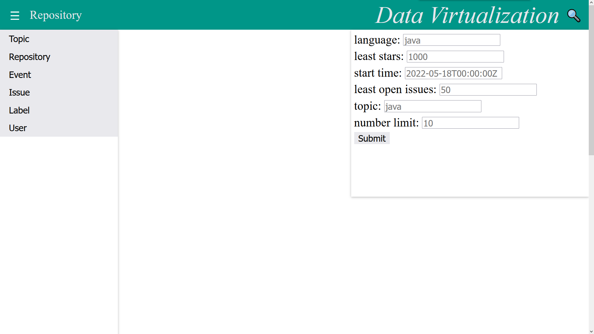
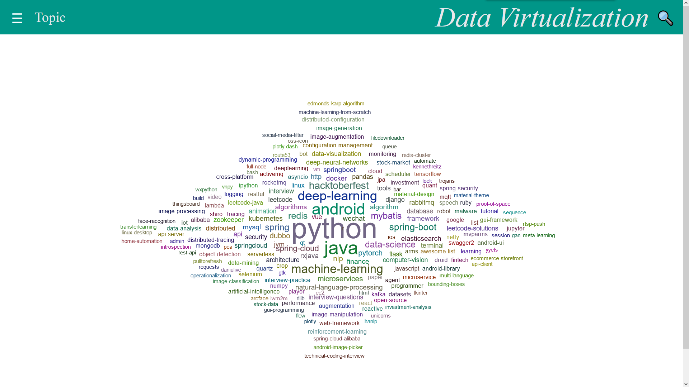
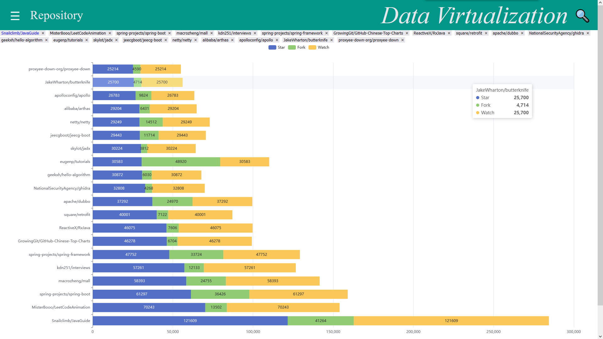
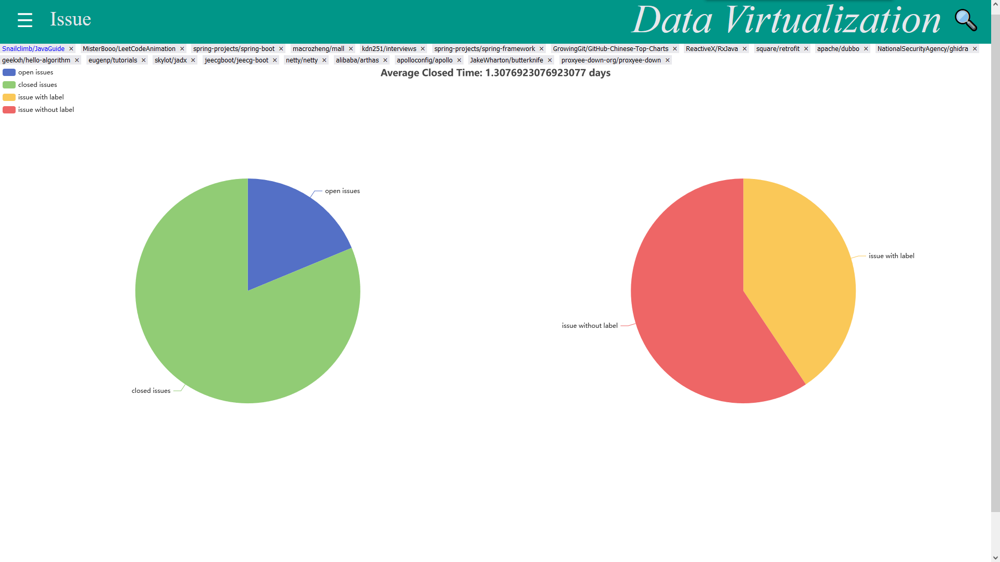
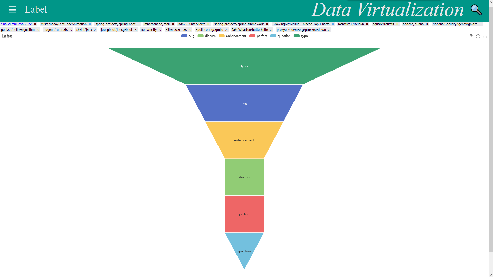
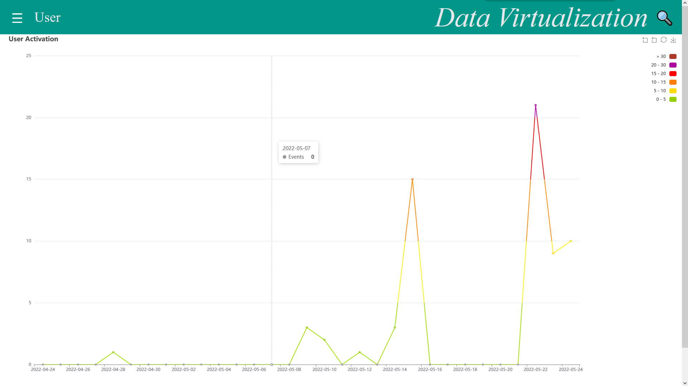

# CS209A Project Report

**11912113 Xing Liu: back-end**

**11910421 Tong Liu: front-end**

[TOC]

Source can be seen in repository [CS209-data-visualization](https://github.com/Leosang-lx/CS209-data-visualiaztion).

## Topic

When people are new to make contributions to open source projects, it is always a problem to choose a proper project to start. This project aims to help people analyze the open source projects in `github.com` and get a clear insight of famous open source projects. With several given filter conditions, you can get a list of repositories and do further analysis on the activation of the repository about the issue and issue events. Results including the frequency distribution of the issue events, and number analysis of the open/closed issues, the average closed time of the issues in a repository and so on. Besides, you can also do queries about recent events of a certain user to evaluate the activation of the user.

## Architecture Design

The architecture of this project mainly consists of two parts, with the front-end to accept data, show the visualization result and the back_end to process the data and respond to the request of the front-end.

### Data Collection

The data are accessed by `github.api` and using `jsoup`. With provided github APIs, we first accessed data about **repositories** with high stars in different languages (like java and python). Then, collect relevant **issues** and **issue events** (what happened to a certain issue) of the all repositories that we have got. To store the data, we use `PostgreSql` as database management system, which is also set as the data source of most queries.

### Design of database



The database has five tables with the above dependency relationships. And the columns in tables are only part of the data that we want to analyze from `api.github.com`. While we didn't take much data for repository, since it cost a lot to collect the relevant data of issues. And the scale of the data can is shown below:

| Table     | github_repos_info | issue  | issue_event | repos_topic | issue_label |
| --------- | ----------------- | ------ | ----------- | ----------- | ----------- |
| **Scale** | 200               | 21,317 | 90,047      | 1,239       | 35,062      |


### Front-end

#### Design Idea

All the operations happened in one html file and with css and javascript. The main idea of changing elements is that adding template element with parameters and delete all the childnode of the special marked element. This makes it easier to manage the website but takes some problems such as cannot find special node or repeated element. In this project I design a great many functions to make sure running safely.

To conveniently use repositories you searched in following searching, I design the tag function to save or delete repository' s name. The important field is currentName and repositoryList, which store the name and highlight current selected. The highlighed repository will guide to the keyword of other searching if you don' t fill the neccessary attribute when searching.

While the front-end part is mainly for data visualization. And the source code of `html` page and the collected data (in `json`) is accessed by sending request to the back-end part.

#### Exhibition

The initial page is shown as follows:



The left side bar is a menu used to choose the viewing content, the search icon on the upper right of the page is the search form with filter parameters. And the hidden menu is shown below:



User can first click "Topic" to show the words cloud picture of the popular topics of famous repositories. And  the topic can be used to filter repositories in the next step.



After submit the filter conditions in Repository page, it will show you the results of repositories meeting the filtering conditions as many labels with the name of the repository's full name, on the top of the page, then a table filled with the data of stars, forks and watchers of repositories will be placed below.



The labels of repositories are selectable and closable. If a certain label of repository is selected, the following analyses will focus on this repository. 

After click tab "Issue", it will show some statistics results on the recent issues of the selected repository.



And if you click "Events", a table showing the frequency distribution of recent issue events of the selected repository will appear.

If you click "Label", it will show you the table will labels and corresponding issues number.



Finally, is the statistic of the events of a certain users, it will show the frequency distribution of user events.



### Back-end

The back-end part consists of database and server using `springboot` as the framework. The database has already stored necessary data. The server will map different URLs to responses including pages in `html`, data in `json` and files in `javascript`. Therefore, it can process the request from the front-end. The data is stored in database and each time when there is a request from the front-end, server will execute corresponding `sql` sentences in database and translate the data to the front-end. All data transported from the front-end to the back-end is in `json` format.

## Important class

Important classes including `getData.java`, `DataController.java`, `PageController.java`.

### GetData.java

```
src/main/java/getData/GetData.java
```

The functions defined in `GetData.java` are mainly used to crawl data from `api.github.com` and store it to database. Also, some data about the user events are directly accessed from the `api.github.com` and sent back to the front-end.

#### Fields

```java
private static Map<String, String> headers = new HashMap<>();
private static final String url = "jdbc:postgresql://localhost:*/*";
private static final String user = "*";
private static final String password = "*";
```

In `GetData.java`, it has filed `headers` designed in Map to store the Github access token of my account, which help us to access the Github API more frequently when sending requests.

And the following `url`, `user`, `password` are used to access the database.

#### Methods

The functions to crawl data from Github API about repositories, repository topics, issues and issue events and store it to database are shown below:

```java
public static void getReposData(){...}
public static void getReposIssues(){...}
public static void getIssueEvents(){...}
public static void getReposTopics(){...};
```

Some SQL queries to get a statistic result will also included in this class, since it can make a random query to database, like statistics of events frequency distribution on dates, and the analysis of different kinds of issues in a certain repository.

``` java
public static Map<String, List<Object>> getTopicsFrequency(){...}
public static Map<String, List<Object>> analyseIssues(){...}
```

Other functions to crawl data directly from Github API will also included in this class, this results won't be stored in database.

```java
public static List<GithubReposInfo> getUserRepos(){...}
public static List<UserEvent> getUserEvents(){...}
```

### DataController.java

```
src/main/java/com/example/springproject/web/DataController.java
```

This class is about the mapping of requests to query data. Return corresponding data response according to the URL. All APIs defined in this class will only transport data to the front-end. With the `springboot` framework, the return value of the functions defined in this controller class (RestController) will transformed to data in `json` format automatically.

#### Methods

The following contents are some important APIs (not all) provided in the back-end.

##### getGithubRepos

This API is used to get github repositories data from the database with some filter conditions.

Example: `localhost:****/filterRepos?language=java&stars=5000&limit=1`

Result:

```java
[{"id":132464395,"full_name":"Snailclimb/JavaGuide","html_url":"https://github.com/Snailclimb/JavaGuide","language":"java","created_at":"2018-05-07T13:27:00Z","stars":121609,"forks":41264,"watch":121609,"open_issues":67}]
```

##### getIssueEvents

This API is used to return the frequency distribution of issue events on dates of a certain repository. 

Example: `localhost:****/issueEvents?repos_name=/JavaGuide`

```java
{"dates":["2022-04-24","2022-04-25","2022-04-26","2022-04-27","2022-04-28","2022-04-29","2022-04-30","2022-05-01","2022-05-02","2022-05-03","2022-05-04","2022-05-05","2022-05-06","2022-05-07","2022-05-08","2022-05-09","2022-05-10","2022-05-11","2022-05-12","2022-05-13","2022-05-14","2022-05-15","2022-05-16","2022-05-17","2022-05-18","2022-05-19","2022-05-20","2022-05-21","2022-05-22","2022-05-23","2022-05-24"],"nums":[0,8,4,2,7,0,0,2,1,2,0,0,7,0,3,0,0,2,3,0,0,6,0,0,2,4,4,5,0,0,0]}
```

##### getUserEvents

This API is used to return the recent user events of a certain user.

Example: `localhost:****/Leosang-lx/userEvents`

```java
{"dates":["2022-04-24","2022-04-25","2022-04-26","2022-04-27","2022-04-28","2022-04-29","2022-04-30","2022-05-01","2022-05-02","2022-05-03","2022-05-04","2022-05-05","2022-05-06","2022-05-07","2022-05-08","2022-05-09","2022-05-10","2022-05-11","2022-05-12","2022-05-13","2022-05-14","2022-05-15","2022-05-16","2022-05-17","2022-05-18","2022-05-19","2022-05-20","2022-05-21","2022-05-22","2022-05-23","2022-05-24"],"nums":[0,0,0,0,1,0,0,0,0,0,0,0,0,0,0,3,2,0,1,0,3,15,0,0,0,0,0,0,21,9,7]}
```

##### topicsFrequency

This API is used to return the frequency distribution of repository labels in database.

Example: `localhost:****/topicsFrequency?limit=10`

```java
[{"name":"python","value":47},{"name":"java","value":27},{"name":"android","value":22},{"name":"deep-learning","value":16},{"name":"machine-learning","value":14},{"name":"hacktoberfest","value":10},{"name":"spring-boot","value":9},{"name":"data-science","value":8},{"name":"mybatis","value":8},{"name":"redis","value":8}]
```

##### getIssues

This API is used to return issues of a certain repository with some filter conditions.

Example: `localhost:****/JavaGuide/issues`

```java
[{"id":1243708832,"repos_id":132464395,"number":1733,"state":"closedI","created_at":"2022-05-20T21:49:10Z","updated_at":"2022-05-21T05:45:05Z","closed_at":"2022-05-21T03:04:30Z","labeled":true},...]
```

##### getReposIssuesNum

This API is used to return some results of the statistics on issues of a certain repository.

Where "t" means number of issues with label, and "f" means number of issues without label.

Example: `localhost:****/JavaGuide/issues_num`

```java
{"t":13,"f":19,"closedI":26,"avg_closed_time":0.0,"openI":6}
```

##### getUserRepos

This API is used to return the repositories list owned by a certain user.

Example: `localhost:****/Leosang-lx/list_repositories`

```java
[{"id":494948523,"full_name":"Leosang-lx/CS209-data-visualiaztion","html_url":"https://github.com/Leosang-lx/CS209-data-visualiaztion","language":"JavaScript","created_at":"2022-05-22T03:22:33Z","stars":1,"forks":0,"watch":1,"open_issues":0},...]
```

##### getUserEvents

This API is used to return user events of a certain user recently.

Example: `localhost:****/Leosang-lx/userevents`

```java
[{"id":21952262271,"type":"PushEvent","actor_id":62881345,"repos_id":494948523,"created_at":"2022-05-24T08:57:44Z"},{"id":21950941706,"type":"PushEvent","actor_id":62881345,"repos_id":494948523,"created_at":"2022-05-24T07:52:31Z"},...]
```

##### downloadFiles

This API is used for downloading necessary file mentioned in `html` file, like `jquery.js`.

Example: `localhost:****/download/js/jquery.js`

After going to the above URL (with correct host IP), the browser will download the file `jquery.js`.


### PageController.java

This class are mainly for the page direction. To enter the homepage of our project, type `localhost:****` then it will redirect to the homepage `New.html`.

Just a simple function to map a URL to the page.

```java
@GetMapping("/index")
public String index(){
    return "Main";
}
@GetMapping()
public String homepage(){
    return "redirect:/index";
}
```


