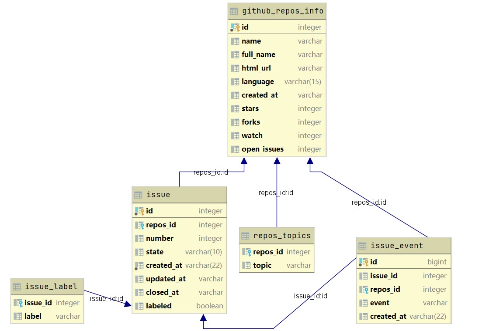

# CS209A Project Report

**11912113 Xing Liu**

**1191 Tong Liu**

[TOC]

Source can be seen in repository [CS209-data-visualization](https://github.com/Leosang-lx/CS209-data-visualiaztion).

## Topic

When people are new to make contributions to open source projects, it is always a problem to choose a proper project to start. This project aims to help people analyze the open source projects in `github.com` and get a clear insight of famous open source projects. With several given filter conditions, you can get a list of repositories and do further analysis on the activation of the repository about the issue and issue events. Results including the frequency distribution of the issue events, and number analysis of the open/closed issues, the average closed time of the issues in a repository and so on. Besides, you can also do queries about recent events of a certain user to evaluate the activation of the user.

## Architecture Design

The architecture of this project mainly consists of two parts, with the front-end to accept data, show the visualization result and the back_end to process the data and respond to the request of the front-end.

### Data Collection

The data are accessed by `github.api` and using `jsoup`. With provided github APIs, we first accessed data about **repositories** with high stars in different languages (like java and python). Then, collect relevant **issues** and **issue events** (what happened to a certain issue) of the all repositories that we have got. To store the data, we use `PostgreSql` as database management system, which is also set as the data source of most queries.

### Design of database



The database has five tables with the above dependency relationships. And the columns in tables are only part of the data that we want to analyze from `api.github.com`. While we didn't take much data for repository, since it cost a lot to collect the relevant data of issues. And the scale of the data can is shown below:

| Table     | github_repos_info | issue  | issue_event | repos_topic | issue_label |
| --------- | ----------------- | ------ | ----------- | ----------- | ----------- |
| **Scale** | 200               | 21,317 | 90,047      | 1,239       | 35,062      |


### Front-end

While the front-end part is mainly for data visualization. And the source code of `html` page and the collected data (in `json`) is accessed by sending request to the back-end part.

(Front-end)

### Back-end

The back-end part consists of database and server using `springboot` as the framework. The database has already stored necessary data. The server will map different URLs to responses including pages in `html`, data in `json` and files in `javascript`. Therefore, it can process the request from the front-end. The data is stored in database and each time when there is a request from the front-end, server will execute corresponding `sql` sentences in database and translate the data to the front-end. All data transported from the front-end to the back-end is in `json` format.

## Important class

Important classes including `getData.java`, `DataController.java`, `PageController.java`.

### GetData.java

```
src/main/java/getData/GetData.java
```

The functions defined in `GetData.java` are mainly used to crawl data from `api.github.com` and store it to database. Also, some data about the user events are directly accessed from the `api.github.com` and sent back to the front-end.

`GetData.java` has static field to store the critical information to access the `api.github.com` and database, like the access token of Github, URL, user and password of database.

The functions to crawl data from Github API about repositories, repository topics, issues and issue events and store it to database are shown below:

```java
public static void getReposData(){...}
public static void getReposIssues(){...}
public static void getIssueEvents(){...}
public static void getReposTopics(){...};
```

Some SQL queries to get a statistic result will also included in this class, since it can make a random query to database, like statistics of events frequency distribution on dates, and the analysis of different kinds of issues in a certain repository.

``` java
public static Map<String, List<Object>> getTopicsFrequency(){...}
public static Map<String, List<Object>> analyseIssues(){...}
```

Other functions to crawl data directly from Github API will also included in this class, this results won't be stored in database.

```java
public static List<GithubReposInfo> getUserRepos(){...}
public static List<UserEvent> getUserEvents(){...}
```

### DataController.java

```
src/main/java/getData/GetData.java
```

This class is about the mapping of requests from the front-end. Return corresponding data response according to the URL. All APIs defined in this class will only transport data to the front-end. With the `springboot` framework, the return value of the functions defined in this controller class (RestController) will transformed to data in `json` format automatically.

This api is to get github repositories data from the database with some filter conditions.

An example is `localhost:****/filterRepos?language=java&stars=5000&limit=50`

```java
@GetMapping("/filterRepos")
@CrossOrigin
public List<GithubReposInfo> getGithubRepos(
    @RequestParam(value="language", required = false)@Nullable String language,
    @RequestParam(value="stars", required = false)@Nullable Integer least_stars,
    @RequestParam(value="since", required = false)@Nullable String since,
    @RequestParam(value="open_issues", required = false)@Nullable Integer open_issues,
    @RequestParam(value="topic",required = false)@Nullable String topic,
    @RequestParam(value="limit", required = false)@Nullable Integer limit){
```

This function will return data of Github repositories in the database.

